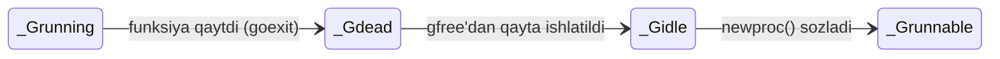

# ⚫ `_Gdead` — ishini tugatgan (yoki hali ishlatilmagan) goroutine

<div align="center">

⬅️ [Ortga: `_Gwaiting`](./Gwaiting.md) · 🏠 [Repo bosh sahifa](../../README.md) · ➡️ [Boshiga: Goroutine · GMP](./README.md)

</div>

> **EN** · *"This goroutine is finished. But its `g` struct is not thrown away — it goes onto a free list and gets reused by the next `go func(){}`."*
> **UZ** · *"Bu goroutine ishini tugatdi. Lekin uning `g` struct'i tashlab yuborilmaydi — u bo'sh ro'yxatga tushadi va keyingi `go func(){}` uni qayta ishlatadi."*

---

## 1️⃣ `_Gdead` nima? / What is it?

| 🇬🇧 English | 🇺🇿 O'zbekcha |
|:-----------|:-------------|
| The goroutine's function has returned — there is no more code to run. | Goroutine'ning funksiyasi qaytdi — bajariladigan kod qolmadi. |
| The runtime frees its stack and clears its fields, but **keeps the `g` struct**. | Runtime uning stekini bo'shatadi va maydonlarini tozalaydi, lekin **`g` struct'ini saqlab qoladi**. |
| The struct goes onto the **`gfree` list** for reuse — this is why `go func(){}` is so cheap. | Struct qayta ishlatish uchun **`gfree` ro'yxatiga** tushadi — `go func(){}` shuning uchun juda arzon. |
| `_Gdead` is also the state of a **fresh, never-used** `g` sitting on that list. | `_Gdead` — bu ro'yxatda yotgan **hali ishlatilmagan yangi** `g`ning ham holati. |
| Dead goroutines are **not** counted by `runtime.NumGoroutine()`. | O'lgan goroutine'lar `runtime.NumGoroutine()` hisobiga **kirmaydi**. |

### 🧠 Analogiya / Analogy

> **EN** · An employee leaves the company. Their desk is cleared, but their personnel card stays in the archive. When a new employee is hired, HR pulls that old card out and writes the new name on it — much faster than printing a new one.
>
> **UZ** · Xodim ishdan bo'shadi. Uning stoli bo'shatiladi, lekin kartochkasi arxivda qoladi. Yangi xodim kelganda, kadrlar bo'limi o'sha eski kartochkani olib, yangi ismni yozadi — yangisini chiqarishdan ancha tez.

---

## 2️⃣ 🗺 Model chizmasi / Model

```text
   ┌───────────────────────┐
   │      _Grunning        │  🟢  G5 ishlayapti
   └───────────┬───────────┘
               │  funksiya  return  qildi
               │  goexit() → goexit0()
               ▼
   ┌───────────────────────┐
   │       _Gdead          │  ⚫  tugadi
   │  • stek bo'shatildi   │
   │  • maydonlar tozalandi│
   │  • NumGoroutine −1    │
   └───────────┬───────────┘
               ▼
   ┌─────────────────────────────────────────────────────┐
   │                 gfree — bo'sh g'lar ro'yxati        │
   │                                                     │
   │   P0.gFree: [g] [g] [g]      ← lokal (≤ 64 ta)     │
   │   P1.gFree: [g] [g]                                 │
   │             │                                       │
   │             │ to'lib ketsa → yarmi markazga         │
   │             ▼                                       │
   │   sched.gFree: [g] [g] [g] [g] [g] …  ← global      │
   └────────────────────────┬────────────────────────────┘
                            │
                            │  yangi:  go func() { … }
                            │  newproc() → gfree'dan oladi
                            ▼
   ┌───────────────────────┐
   │       _Gidle          │  ⚪  qayta ishlatilmoqda
   └───────────┬───────────┘
               ▼
   ┌───────────────────────┐
   │     _Grunnable        │  🟡  yangi hayot boshlandi
   └───────────────────────┘
```



---

## 3️⃣ Nega qayta ishlatiladi? / Why reuse?

| 🇬🇧 English | 🇺🇿 O'zbekcha |
|:-----------|:-------------|
| Allocating a new `g` struct plus a stack means touching the memory allocator and the GC. | Yangi `g` struct va stek ajratish — bu allokator va GC'ni bezovta qilish demak. |
| Reusing one from `gfree` skips all of that: it's just popping an item off a list. | `gfree`dan qayta ishlatish bularning hammasini o'tkazib yuboradi — bu shunchaki ro'yxatdan element olish. |
| That's a big part of why creating a goroutine takes **nanoseconds**, not microseconds. | Goroutine yaratish **mikrosekund emas, nanosekund** vaqt olishining katta sababi shu. |
| Small stacks (2 KB) are cached too, so short-lived goroutines are nearly free. | Kichik steklar (2 KB) ham keshlanadi, shuning uchun qisqa umrli goroutine'lar deyarli tekin. |

| Ro'yxat | Joyi | Sig'imi | Vazifasi |
|:--------|:-----|:-------:|:---------|
| `p.gFree` | Har bir P ichida | 64 ta | Lokal, qulfsiz — eng tez yo'l |
| `sched.gFree` | Global scheduler'da | Cheklanmagan | Lokal to'lganda yarmi shu yerga o'tadi |

---

## 4️⃣ ⚠️ Goroutine'ni tashqaridan o'ldirib bo'lmaydi

Bu — Go'dagi eng muhim va eng ko'p adashiladigan qoidalardan biri.

| 🇬🇧 English | 🇺🇿 O'zbekcha |
|:-----------|:-------------|
| There is **no** `goroutine.Kill()`, no ID, no handle — you cannot stop someone else's goroutine. | `goroutine.Kill()` **yo'q**, ID yo'q, hech qanday tutqich yo'q — boshqa goroutine'ni to'xtata olmaysiz. |
| The **only** way to reach `_Gdead` is for the goroutine's own function to return (or panic). | `_Gdead`ga yetishning **yagona** yo'li — goroutine o'z funksiyasidan qaytishi (yoki panic bo'lishi). |
| So you must **ask** it to stop, and it must agree — usually via `context` or a channel. | Shuning uchun undan to'xtashni **so'rashingiz** kerak, u esa rozi bo'lishi kerak — odatda `context` yoki channel orqali. |
| A goroutine that never returns is a [leak](./Gwaiting.md#leak) — it holds its stack forever. | Hech qachon qaytmaydigan goroutine — bu [leak](./Gwaiting.md#leak), u stekini abadiy ushlab turadi. |

### ❌ Noto'g'ri / Wrong

```go
go worker()   // ishga tushirdik...
// ...va uni to'xtatishning hech qanday yo'li yo'q ❌
```

### ✅ To'g'ri / Right

```go
func worker(ctx context.Context) {
    for {
        select {
        case <-ctx.Done():
            return                 // ✅ mana shu yerda _Gdead bo'ladi
        default:
            doWork()
        }
    }
}

ctx, cancel := context.WithCancel(context.Background())
go worker(ctx)
cancel()   // "iltimos, to'xta" — majburlash emas, so'rash
```

### 💥 `panic` bo'lsa nima bo'ladi?

| 🇬🇧 English | 🇺🇿 O'zbekcha |
|:-----------|:-------------|
| A panic inside a goroutine that is not recovered **crashes the whole program**. | Goroutine ichidagi `recover` qilinmagan panic **butun dasturni qulatadi**. |
| `recover()` only works inside a `defer` **in that same goroutine** — you cannot catch another goroutine's panic. | `recover()` faqat **o'sha goroutine ichidagi** `defer`da ishlaydi — boshqa goroutine'ning panic'ini ushlab bo'lmaydi. |
| After a recovered panic the goroutine still ends → `_Gdead`. | Recover qilingandan keyin ham goroutine tugaydi → `_Gdead`. |

```go
go func() {
    defer func() {
        if r := recover(); r != nil {   // ✅ o'z ichida ushlanadi
            log.Println("tiklandi:", r)
        }
    }()
    panic("xatolik")
}()
```

---

## 5️⃣ Intervyu savollari / Interview questions

| # | Savol / Question | Kalit javob / Key answer |
|:-:|:-----------------|:-------------------------|
| 1 | Goroutine tugagach `g` struct o'chiriladimi? | Yo'q — `_Gdead` bo'lib `gfree` ro'yxatiga tushadi va qayta ishlatiladi. |
| 2 | Boshqa goroutine'ni to'xtata olamizmi? | Yo'q. Faqat `context` yoki channel orqali "to'xta" deb so'rash mumkin — u o'zi qaytishi kerak. |
| 3 | Goroutine'da panic bo'lsa nima bo'ladi? | `recover` qilinmasa — butun dastur qulaydi. `recover` faqat o'sha goroutine ichidagi `defer`da ishlaydi. |
| 4 | Nega goroutine yaratish shunchalik arzon? | `gfree`dan tayyor `g` struct va keshlangan stek olinadi — yangi allokatsiya deyarli qilinmaydi. |
| 5 | `_Gdead` goroutine `NumGoroutine()`da ko'rinadimi? | Yo'q — u hisobdan chiqariladi. Agar son o'sib ketayotgan bo'lsa, demak goroutine'lar `_Gdead` bo'lmayapti (leak). |

---

## 🔄 To'liq hayot sikli — yakuniy xulosa

| Holat | Belgi | Bir jumlada / In one line | Qayerda turadi |
|:------|:-----:|:--------------------------|:---------------|
| [`_Gidle`](./README.md#gidle) | ⚪ | Ajratildi, lekin hali sozlanmagan. | Hech qayerda (o'tkinchi) |
| [`_Grunnable`](./Grunnable.md) | 🟡 | Tayyor, CPU navbatini kutmoqda. | LRQ / GRQ / runnext |
| [`_Grunning`](./Grunning.md) | 🟢 | Ayni damda ishlamoqda. | M + P ustida |
| [`_Gsyscall`](./Gsyscall.md) | 🟠 | Kernel ichida, thread bloklangan. | M'ga bog'langan, P bo'shatilgan |
| [`_Gwaiting`](./Gwaiting.md) | 🔵 | Hodisani kutmoqda, uyg'otish kerak. | Obyektning kutish navbatida |
| **`_Gdead`** | ⚫ | Tugadi, qayta ishlatishga tayyor. | `gfree` ro'yxatida |

---

<div align="center">

⬅️ [Ortga: `_Gwaiting`](./Gwaiting.md) · 🏠 [Repo bosh sahifa](../../README.md) · ➡️ [Boshiga: Goroutine · GMP](./README.md)

</div>
