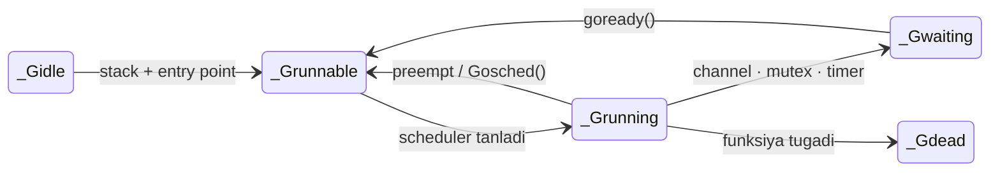

# 🟡 `_Grunnable` — navbatda kutayotgan goroutine

<div align="center">

⬅️ [Ortga: Goroutine · GMP · `_Gidle`](./README.md) · 🏠 [Repo bosh sahifa](../../README.md)

</div>

> **EN** · *"This goroutine is fully set up and ready to execute, but it's not running yet — it's sitting in a queue waiting for a CPU core (via a P) to pick it up."*
> **UZ** · *"Bu goroutine to'liq tayyor, ishga tushirish uchun hammasi bor, lekin hali ishlamayapti — u navbatda turibdi, biror CPU yadrosi (P orqali) uni olib ishga tushirishini kutmoqda."*

---

## 1️⃣ `_Grunnable` nima? / What is it?

| 🇬🇧 English | 🇺🇿 O'zbekcha |
|:-----------|:-------------|
| `_Grunnable` is the state right **after** [`_Gidle`](./README.md#gidle). | `_Grunnable` — bu [`_Gidle`](./README.md#gidle) dan **keyingi** holat. |
| The stack, entry function and arguments are all in place — **everything is ready**. | Stek, boshlanish funksiyasi va argumentlar — **hammasi tayyor**. |
| The only thing missing is a **turn on the CPU**: it needs a P to schedule it onto an M. | Yetishmayotgan yagona narsa — **CPU'dagi navbat**: uni M ustiga qo'yish uchun P kerak. |
| A goroutine can re-enter this state **many times** over its life. | Goroutine o'z umri davomida bu holatga **ko'p marta** qaytishi mumkin. |

### 🧠 Analogiya / Analogy

> **EN** · Like a customer who has taken a number at a busy deli counter. They know exactly what they want (their function, arguments and stack are ready) — they're just waiting for their number to be called.
>
> **UZ** · Band bo'lgan oshxonada navbat raqamini olgan mijozday. U nima buyurtma qilishini aniq biladi (funksiyasi, argumentlari, steki — hammasi tayyor), faqat o'z navbati chaqirilishini kutyapti.

---

## 2️⃣ 🗺 Model chizmasi / State machine

```text
                    ┌───────────────────────┐
                    │        _Gidle         │
                    │   (endigina ajratildi)│
                    └───────────┬───────────┘
                                │ stack + entry point tayinlandi
                                │ stack + entry point assigned
                                ▼
    ┌──────────────▶┌───────────────────────┐
    │               │      _Grunnable       │  🟡  runq'da kutmoqda
    │               │   tayyor, navbatda    │      waiting in a run queue
    │               └───────────┬───────────┘
    │                           │ scheduler uni tanlab oladi
    │                           │ scheduler picks it up
    │                           ▼
    │               ┌───────────────────────┐
    │               │      _Grunning        │  🟢  M ustida bajarilmoqda
    │               │   ishlamoqda (M+P)    │      executing on an M
    │               └───────────┬───────────┘
    │                           │
    │   ┌───────────────────────┼───────────────────────┐
    │   │ ~10ms tugadi          │ channel / mutex /     │ funksiya tugadi
    │   │ preempt qilindi       │ timer blokladi        │ function returned
    │   │ runtime.Gosched()     │                       │
    │   ▼                       ▼                       ▼
    │  (qaytadi)     ┌───────────────────────┐  ┌────────────────┐
    └────────────────│      _Gwaiting        │  │    _Gdead      │
         ▲           │   bloklangan          │  │  gfree'ga      │
         │           └───────────┬───────────┘  └────────────────┘
         │                       │ blok ochildi (ready)
         └───────────────────────┘ goready() → runq
```



> ⚠️ **Diqqat:** har safar goroutine to'xtatilganda (preempt) yoki o'zi navbatni bo'shatganda, u yana ishlashdan oldin **"navbatni kutish"** holatiga qaytadi. `_Grunnable` — bir martalik emas, **tsiklik** holat.

---

## 3️⃣ Bu holatga qanday kelinadi? / How a goroutine gets here

| Qayerdan / From | 🇬🇧 Trigger | 🇺🇿 Sabab |
|:----------------|:-----------|:----------|
| `_Gidle` | Right after `newproc()` initializes the stack and entry function. | `newproc()` stek va boshlanish funksiyasini o'rnatgandan darhol keyin. |
| `_Gwaiting` | A blocking operation completes — a channel receive unblocks, a mutex is released, a timer fires. The runtime moves it from *blocked* back to *ready*. | Bloklovchi operatsiya tugaydi — channel'dan ma'lumot keladi, mutex bo'shatiladi, timer ishga tushadi. Runtime uni *bloklangan*dan *tayyor*ga o'tkazadi. |
| `_Grunning` | Its ~10 ms time slice expires and it gets preempted, **or** it calls `runtime.Gosched()` voluntarily. | Vaqt bo'lagi (~10 ms) tugab, u preempt qilinadi, **yoki** `runtime.Gosched()` chaqirib o'zi ixtiyoriy ravishda navbatni bo'shatadi. |
| `_Gsyscall` | The system call returns and the goroutine reacquires a P. | System call qaytadi va goroutine qaytadan P oladi. |

---

## 4️⃣ Kutayotganda qayerda "yashaydi"? / Where it lives while waiting

Runnable goroutine'lar **run queue** (navbat)larda turadi:

| Navbat | To'liq nomi | Sig'imi | 🇬🇧 Role | 🇺🇿 Vazifasi |
|:------:|:------------|:-------:|:--------|:-------------|
| **LRQ** | Local Run Queue | **256** G | Per-P, small, fast, lock-free ring buffer. First place the scheduler looks. | Har bir P'ga tegishli; kichik, tez, lock-free halqa bufer. Scheduler birinchi shu yerga qaraydi. |
| **GRQ** | Global Run Queue | ∞ (mutex bilan) | Shared across all Ps. Used as overflow and to prevent starvation. | Barcha P'lar uchun umumiy. Ortiqcha yuklama uchun va "ochlik" (starvation)ning oldini olish uchun. |
| **runnext** | next-G slot | **1** G | A single-slot fast path for the most recently readied goroutine (cache locality). | Eng oxirgi tayyorlangan goroutine uchun bitta o'rinli tezkor yo'l (kesh yaqinligi uchun). |

### 🗺 Navbatlar chizmasi

```text
   ┌─────────────────────────── P0 ────────────────────────────┐
   │                                                           │
   │   runnext ▸ [ G9 ]        ← eng "issiq" G, 1 ta slot      │
   │                                                           │
   │   LRQ     ▸ ┌────┬────┬────┬────┬─ … ─┬─────┐             │
   │             │ G1 │ G2 │ G3 │ G4 │     │ 256 │  lock-free  │
   │             └────┴────┴────┴────┴─ … ─┴─────┘             │
   │                                    │                      │
   └────────────────────────────────────┼──────────────────────┘
                                        │ to'lib ketsa → yarmi GRQ'ga
                                        ▼
   ┌───────────────────────── GRQ (global) ────────────────────┐
   │   G20   G21   G22   G23   G24   …        mutex bilan      │
   └───────────────────────────────────────────────────────────┘

   Scheduler qidirish tartibi / lookup order:
   1) runnext   →   2) LRQ   →   3) GRQ (har 61-tsiklda majburiy)   →   4) work stealing
```

### 🔀 Work stealing / Ish o'g'irlash

| 🇬🇧 English | 🇺🇿 O'zbekcha |
|:-----------|:-------------|
| If a P's local queue is empty, it will "steal" **half** the goroutines from another P's queue. | Agar P'ning lokal navbati bo'sh bo'lsa, u boshqa P navbatidan goroutine'larning **yarmini** "o'g'irlab" oladi. |
| This is how Go balances load across cores automatically — no manual tuning needed. | Go shu tarzda yadrolar orasida yukni avtomatik muvozanatlaydi — qo'lda sozlash kerak emas. |
| Every 61st scheduling tick a P checks the GRQ first, so global goroutines never starve. | Har 61-scheduling tsiklida P avval GRQ'ni tekshiradi — shunda global goroutine'lar "ochlikda" qolmaydi. |

```text
   P0 (band / busy)                        P1 (bo'sh / idle)
   ┌──────────────────────┐                ┌──────────────────────┐
   │ LRQ: G1 G2 G3 G4     │                │ LRQ: (bo'sh)         │
   │      G5 G6           │                │                      │
   └──────────┬───────────┘                └──────────▲───────────┘
              │                                       │
              │   ── yarmini o'g'irlaydi (steal ½) ──▶│
              │      G4  G5  G6                       │
              ▼                                       │
   ┌──────────────────────┐                ┌──────────────────────┐
   │ LRQ: G1 G2 G3        │                │ LRQ: G4 G5 G6        │
   └──────────────────────┘                └──────────────────────┘
```

---

## 5️⃣ Intervyu savollari / Interview questions

| # | Savol / Question | Kalit javob / Key answer |
|:-:|:-----------------|:-------------------------|
| 1 | `_Grunnable` va `_Grunning` farqi nima? | `_Grunnable` — tayyor, lekin navbatda; `_Grunning` — ayni damda M ustida bajarilmoqda. |
| 2 | LRQ to'lib ketsa nima bo'ladi? | Navbatning yarmi (~128 ta G) GRQ'ga ko'chiriladi. |
| 3 | Nega har 61-tsiklda GRQ tekshiriladi? | GRQ'dagi goroutine'lar starvation'ga tushmasligi uchun — LRQ doim to'la bo'lsa ular hech qachon navbat olmasdi. |
| 4 | `runtime.Gosched()` nima qiladi? | Joriy goroutine'ni `_Grunning` → `_Grunnable` ga o'tkazib, uni navbatga qaytaradi va CPU'ni bo'shatadi. |
| 5 | Goroutine preempt qilinishi uchun nima kerak? | Go 1.14+ da asinxron preemption bor: sysmon ~10 ms dan ortiq ishlagan G'ga signal yuboradi (`_Gpreempted`). Undan oldin faqat funksiya chaqiruvlarida kooperativ preemption bo'lgan. |

---

<div align="center">

⬅️ [Ortga: Goroutine · GMP · `_Gidle`](./README.md) · 🏠 [Repo bosh sahifa](../../README.md) · ➡️ [Keyingi: `_Grunning`](./Grunning.md)

</div>
