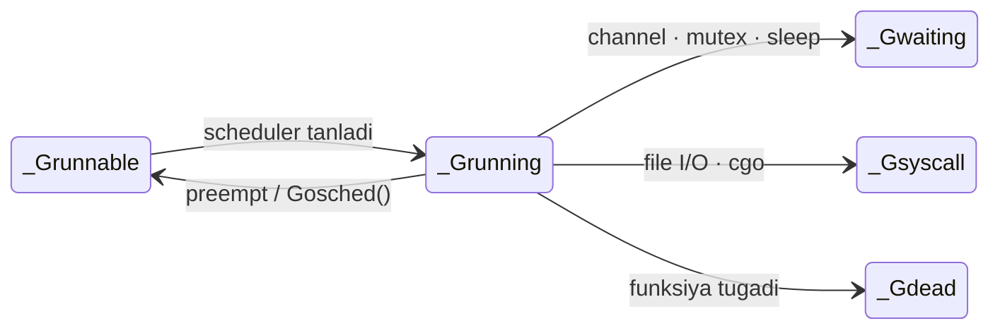

# 🟢 `_Grunning` — ayni damda ishlayotgan goroutine

<div align="center">

⬅️ [Ortga: `_Grunnable`](./Grunnable.md) · 🏠 [Repo bosh sahifa](../../README.md) · ➡️ [Keyingi: `_Gsyscall`](./Gsyscall.md)

</div>

> **EN** · *"This goroutine is executing right now. It sits on an M (OS thread) which holds a P, and it owns the CPU until it blocks, finishes, or gets preempted."*
> **UZ** · *"Bu goroutine ayni damda ishlamoqda. U P ushlab turgan M (OS thread) ustida turibdi va bloklanmaguncha, tugamaguncha yoki to'xtatilmaguncha CPU unga tegishli."*

---

## 1️⃣ `_Grunning` nima? / What is it?

| 🇬🇧 English | 🇺🇿 O'zbekcha |
|:-----------|:-------------|
| The goroutine has been taken out of a run queue and is now **actually executing** machine code. | Goroutine navbatdan olindi va endi **haqiqatan ham** mashina kodini bajarmoqda. |
| To be here it needs a full **G + M + P** triple — a goroutine, a thread, and a scheduling permit. | Bu holatda bo'lish uchun to'liq **G + M + P** uchligi kerak — goroutine, thread va scheduling ruxsatnomasi. |
| One M runs **exactly one** goroutine at a time. | Bitta M ayni bir vaqtda **faqat bitta** goroutine'ni bajaradi. |
| So the number of `_Grunning` goroutines **can never exceed `GOMAXPROCS`**. | Shuning uchun `_Grunning` goroutine'lar soni **hech qachon `GOMAXPROCS`dan oshmaydi**. |
| It is **not** the final state — the goroutine will leave it many times before it dies. | Bu **oxirgi** holat emas — goroutine o'lmasidan oldin bu holatdan ko'p marta chiqadi. |

### 🧠 Analogiya / Analogy

> **EN** · The deli customer's number has finally been called. They are at the counter being served *right now*. But the shop has a rule: if you take too long, you're asked to step aside and take a new number.
>
> **UZ** · Oshxonadagi mijozning navbat raqami nihoyat chaqirildi. U hozir kassada xizmat olmoqda. Lekin do'konda qoida bor: agar juda uzoq vaqt olsangiz, sizdan chetga chiqib yangi raqam olish so'raladi.

---

## 2️⃣ 🗺 Model chizmasi / Model

```text
   ┌──────────────────────────────────────────────────────────────┐
   │                  BAJARILISH UCHUN KERAK BO'LGAN UCHLIK        │
   │                                                               │
   │     ┌─────────┐      ┌─────────┐      ┌─────────┐            │
   │     │    M    │  +   │    P    │  +   │    G    │  =  ✅      │
   │     │OS thread│      │ruxsatn. │      │  kod    │   ishlaydi │
   │     └─────────┘      └─────────┘      └─────────┘            │
   │                                                               │
   │     Uchtasidan biri yetishmasa → goroutine ishlay olmaydi     │
   └──────────────────────────────────────────────────────────────┘


                     ┌───────────────────────┐
                     │      _Grunnable       │  🟡 navbatda
                     └───────────┬───────────┘
                                 │ schedule() → execute()
                                 ▼
                     ┌───────────────────────┐
                     │      _Grunning        │  🟢 ISHLAMOQDA
                     │      (M + P + G)      │     ~10 ms gacha
                     └───────────┬───────────┘
                                 │
        ┌────────────┬───────────┼───────────┬────────────────┐
        │            │           │           │                │
        ▼            ▼           ▼           ▼                ▼
   ┌─────────┐  ┌─────────┐ ┌─────────┐ ┌─────────┐    ┌───────────┐
   │ preempt │  │Gosched()│ │ channel │ │ syscall │    │  return   │
   │ ~10 ms  │  │ o'zi    │ │ mutex   │ │ file I/O│    │ funksiya  │
   │ tugadi  │  │ bo'shatd│ │ sleep   │ │  cgo    │    │  tugadi   │
   └────┬────┘  └────┬────┘ └────┬────┘ └────┬────┘    └─────┬─────┘
        │            │           │           │                │
        ▼            ▼           ▼           ▼                ▼
   _Grunnable   _Grunnable   _Gwaiting   _Gsyscall         _Gdead
      🟡            🟡           🔵          🟠               ⚫
```



---

## 3️⃣ Bu holatdan qanday chiqiladi? / How it leaves this state

| Qayerga / To | 🇬🇧 Trigger | 🇺🇿 Sabab |
|:-------------|:-----------|:----------|
| 🟡 `_Grunnable` | Preempted after its ~10 ms time slice, or it called `runtime.Gosched()` itself. | ~10 ms vaqti tugab to'xtatildi, yoki o'zi `runtime.Gosched()` chaqirdi. |
| 🔵 [`_Gwaiting`](./Gwaiting.md) | It blocked on something: channel, mutex, `time.Sleep`, network I/O. | Biror narsada bloklandi: channel, mutex, `time.Sleep`, tarmoq I/O. |
| 🟠 [`_Gsyscall`](./Gsyscall.md) | It entered a real blocking system call (file read, cgo call). | Haqiqiy bloklovchi system call'ga kirdi (fayl o'qish, cgo chaqiruvi). |
| ⚫ [`_Gdead`](./Gdead.md) | Its function returned — the goroutine is finished. | Funksiyasi tugadi — goroutine ishini yakunladi. |

---

## 4️⃣ Preemption — "vaqting tugadi, chetga chiq"

**EN** · Preemption is how Go stops a goroutine that has been running too long, so other goroutines get a turn.
**UZ** · Preemption — bu Go'ning juda uzoq ishlagan goroutine'ni to'xtatib, boshqalarga navbat berish usuli.

| Turi / Type | Qachon ishlaydi | 🇬🇧 How it works | 🇺🇿 Qanday ishlaydi |
|:------------|:----------------|:----------------|:--------------------|
| **Kooperativ**<br/>*(cooperative)* | Har bir funksiya chaqiruvida | At every function call Go checks the stack guard; if a preempt flag is set, the goroutine yields. | Har bir funksiya chaqiruvida Go stek chegarasini tekshiradi; agar to'xtatish bayrog'i qo'yilgan bo'lsa, goroutine navbatni bo'shatadi. |
| **Asinxron**<br/>*(async, Go 1.14+)* | Funksiya chaqiruvisiz sikllarda ham | `sysmon` sends a `SIGURG` signal to the thread, which interrupts the goroutine wherever it is. | `sysmon` thread'ga `SIGURG` signalini yuboradi va goroutine qayerda bo'lsa ham to'xtatiladi. |
| **Ixtiyoriy**<br/>*(voluntary)* | Dasturchi o'zi chaqirganda | `runtime.Gosched()` — the goroutine gives up the CPU on purpose. | `runtime.Gosched()` — goroutine CPU'ni ataylab bo'shatadi. |

### 👮 `sysmon` — nazoratchi thread

| 🇬🇧 English | 🇺🇿 O'zbekcha |
|:-----------|:-------------|
| `sysmon` is a special thread that runs **without a P**, in a loop, forever. | `sysmon` — bu **P'siz** ishlaydigan, cheksiz siklda aylanadigan maxsus thread. |
| Every 10 ms it looks for goroutines that have been `_Grunning` too long and preempts them. | Har 10 ms da u juda uzoq `_Grunning` bo'lgan goroutine'larni topib, to'xtatadi. |
| It also retakes Ps stuck in long system calls and wakes up the network poller. | Shuningdek, uzoq system call'da qotib qolgan P'larni qaytarib oladi va tarmoq poller'ini uyg'otadi. |

### ⚠️ Nega asinxron preemption qo'shilgan?

```go
// Go 1.13 va undan oldin — BU DASTURNI QOTIRIB QO'YARDI
// Go 1.13 and earlier — THIS WOULD FREEZE THE PROGRAM
func main() {
    runtime.GOMAXPROCS(1)
    go func() {
        for {} // ❌ funksiya chaqiruvi yo'q → preempt qilib bo'lmaydi
    }()
    time.Sleep(time.Second)
    fmt.Println("bu qator hech qachon chop etilmasdi")
}
```

| 🇬🇧 English | 🇺🇿 O'zbekcha |
|:-----------|:-------------|
| A tight loop with no function calls had no preemption point, so it never yielded. | Funksiya chaqiruvi yo'q zich sikl'da to'xtatish nuqtasi bo'lmagani uchun u hech qachon navbatni bo'shatmasdi. |
| It froze the scheduler **and the garbage collector**, which must pause all goroutines. | Bu scheduler'ni **va garbage collector'ni** qotirib qo'yardi — GC barcha goroutine'larni to'xtatishi shart. |
| Go 1.14 fixed it with signal-based async preemption. | Go 1.14 buni signalga asoslangan asinxron preemption bilan hal qildi. |

---

## 5️⃣ Intervyu savollari / Interview questions

| # | Savol / Question | Kalit javob / Key answer |
|:-:|:-----------------|:-------------------------|
| 1 | Bir vaqtning o'zida nechta goroutine `_Grunning` bo'la oladi? | Ko'pi bilan `GOMAXPROCS` ta — chunki har bir bajarilish uchun P kerak. |
| 2 | Goroutine ishlashi uchun nima kerak? | To'liq **G + M + P** uchligi. Bittasi yetishmasa — ishlamaydi. |
| 3 | `sysmon` nima qiladi? | P'siz ishlaydigan nazoratchi thread: uzoq ishlagan G'larni preempt qiladi, uzoq syscall'dagi P'larni qaytarib oladi, netpoller'ni uyg'otadi. |
| 4 | `for {}` sikli Go 1.14 gacha nega dasturni qotirardi? | Preemption nuqtasi (funksiya chaqiruvi) yo'q edi → scheduler ham, GC ham to'xtab qolardi. |
| 5 | Vaqt bo'lagi (time slice) qancha? | Taxminan **10 ms**, `sysmon` shu chegaradan oshganini tekshiradi. |

---

<div align="center">

⬅️ [Ortga: `_Grunnable`](./Grunnable.md) · 🏠 [Repo bosh sahifa](../../README.md) · ➡️ [Keyingi: `_Gsyscall`](./Gsyscall.md)

</div>
