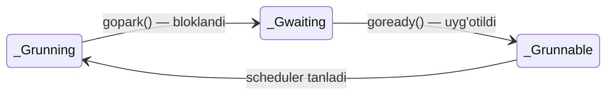

# 🔵 `_Gwaiting` — bloklangan, uyg'otilishini kutayotgan goroutine

<div align="center">

⬅️ [Ortga: `_Gsyscall`](./Gsyscall.md) · 🏠 [Repo bosh sahifa](../../README.md) · ➡️ [Keyingi: `_Gdead`](./Gdead.md)

</div>

> **EN** · *"This goroutine is blocked waiting for an event. It is **not** in any run queue and uses **zero** CPU. Someone else must explicitly wake it up."*
> **UZ** · *"Bu goroutine biror hodisani kutib bloklangan. U **hech qanday** navbatda emas va CPU'ni **umuman** ishlatmaydi. Uni kimdir boshqa birov ataylab uyg'otishi shart."*

---

## 1️⃣ `_Gwaiting` nima? / What is it?

| 🇬🇧 English | 🇺🇿 O'zbekcha |
|:-----------|:-------------|
| The goroutine hit something it must wait for: a channel, a lock, a timer, network data. | Goroutine kutishi shart bo'lgan narsaga duch keldi: channel, qulf (lock), timer, tarmoq ma'lumoti. |
| The runtime calls `gopark()` — the goroutine is **parked** and the M is free to run others. | Runtime `gopark()` chaqiradi — goroutine **to'xtatiladi**, M esa boshqalarni bajarishga bo'shaydi. |
| It is **removed from all run queues** and attached to the *wait queue of the thing it waits for*. | U **barcha navbatlardan chiqariladi** va *kutayotgan obyektining kutish navbatiga* ulanadi. |
| It will **never** run again by itself — another goroutine must call `goready()` on it. | U **hech qachon** o'zicha ishga tushmaydi — boshqa goroutine unga `goready()` chaqirishi kerak. |
| Waiting is **free**: a million parked goroutines cost memory, not CPU. | Kutish **tekin**: million to'xtagan goroutine xotira yeydi, CPU emas. |

### 🧠 Analogiya / Analogy

> **EN** · At the deli, you order something that must be cooked. Instead of standing in the queue, you're told *"go sit down, we'll call your name."* You leave the queue entirely — and you only come back when someone calls you.
>
> **UZ** · Oshxonada siz pishirilishi kerak bo'lgan taom buyurtma qildingiz. Navbatda turish o'rniga sizga *"borib o'tiring, ismingizni chaqiramiz"* deyishadi. Siz navbatdan butunlay chiqasiz — va faqat kimdir chaqirgandagina qaytasiz.

### 🔑 `_Grunnable` bilan farqi — eng muhim jadval

| | 🟡 `_Grunnable` | 🔵 `_Gwaiting` |
|:--|:----------------|:---------------|
| Qayerda turadi | Run queue'da (LRQ / GRQ) | Obyektning kutish navbatida (`sendq`, `recvq`, sema) |
| Ishga tayyormi | ✅ Ha — faqat CPU navbatini kutmoqda | ❌ Yo'q — hodisa sodir bo'lishini kutmoqda |
| O'zi ishga tusha oladimi | ✅ Ha, scheduler uni tanlaydi | ❌ Yo'q, kimdir uyg'otishi shart |
| Nima kutmoqda | **CPU** | **Hodisa** (ma'lumot, qulf, vaqt) |
| Deadlock'ga sabab bo'ladimi | Yo'q | ✅ Ha — hammasi shu holatda qolsa |

---

## 2️⃣ 🗺 Model chizmasi / Model

```text
   ┌───────────────────────┐
   │      _Grunning        │  🟢  G5 ishlayapti
   └───────────┬───────────┘
               │  val := <-ch      (ch bo'sh!)
               │  gopark()
               ▼
   ┌───────────────────────┐
   │      _Gwaiting        │  🔵  G5 to'xtatildi
   │  run queue'da EMAS    │      CPU ishlatmaydi
   └───────────────────────┘
               │
               │  G5 mana shu yerda "yashaydi":
               ▼
   ┌─────────────────────────────────────────────┐
   │            channel  ch                      │
   │  ┌───────────────────────────────────────┐  │
   │  │ buf:    [ bo'sh ]                     │  │
   │  │ recvq:  [ G5 ] [ G8 ]  ← kutayotganlar│  │
   │  │ sendq:  [     ]                       │  │
   │  └───────────────────────────────────────┘  │
   └─────────────────────────────────────────────┘
               ▲
               │  boshqa goroutine:  ch <- 42
               │  goready(G5)
               ▼
   ┌───────────────────────┐
   │      _Grunnable       │  🟡  G5 navbatga qaytdi
   └───────────┬───────────┘      (runnext yoki LRQ)
               ▼
   ┌───────────────────────┐
   │      _Grunning        │  🟢  yana ishlayapti
   └───────────────────────┘
```



---

## 3️⃣ Nima sabablardan `_Gwaiting` bo'ladi?

| Sabab / Reason | Kod misoli | 🇬🇧 Woken up by | 🇺🇿 Kim uyg'otadi |
|:---------------|:-----------|:----------------|:------------------|
| Channel'dan o'qish | `v := <-ch` | Another goroutine sends a value | Boshqa goroutine qiymat yuborganda |
| Channel'ga yozish | `ch <- v` | A receiver takes the value (or buffer frees up) | Qabul qiluvchi qiymatni olganda (yoki bufer bo'shaganda) |
| Mutex qulfi | `mu.Lock()` | The owner calls `Unlock()` | Egasi `Unlock()` chaqirganda |
| WaitGroup | `wg.Wait()` | The counter reaches zero | Hisoblagich nolga tushganda |
| Uyqu | `time.Sleep(d)` | The runtime timer fires | Runtime timer'i ishga tushganda |
| Tarmoq I/O | `conn.Read(b)` | The **netpoller** reports the socket is ready | **Netpoller** soket tayyorligini bildirganda |
| `select` | `select { … }` | Any one of the cases becomes ready | Case'lardan biri tayyor bo'lganda |
| GC | — | The garbage collector finishes its phase | Garbage collector bosqichini tugatganda |

---

<a id="leak"></a>

## 4️⃣ ⚠️ Deadlock va goroutine leak

### 💀 Deadlock — hamma uxlab qolganda

```go
func main() {
    ch := make(chan int) // buferi yo'q
    <-ch                 // ❌ hech kim hech narsa yubormaydi
}
```

```text
fatal error: all goroutines are asleep - deadlock!
```

| 🇬🇧 English | 🇺🇿 O'zbekcha |
|:-----------|:-------------|
| The runtime counts how many goroutines exist and how many are parked. | Runtime nechta goroutine borligini va nechtasi to'xtaganini sanaydi. |
| If **every** goroutine is `_Gwaiting` and no timer or netpoller can wake anyone → nobody ever will. | Agar **barcha** goroutine `_Gwaiting` bo'lsa va hech qanday timer yoki netpoller uyg'ota olmasa → hech qachon hech kim uyg'onmaydi. |
| So Go panics immediately with `all goroutines are asleep - deadlock!`. | Shuning uchun Go darhol `all goroutines are asleep - deadlock!` xatosi bilan to'xtaydi. |
| ⚠️ Go detects this only when **all** goroutines are stuck — a partial deadlock is silent. | ⚠️ Go buni faqat **hammasi** qotib qolgandagina aniqlaydi — qisman deadlock jimgina qoladi. |

### 🕳 Goroutine leak — jimgina yo'qotish

```go
func leak() {
    ch := make(chan int)
    go func() {
        val := <-ch      // ❌ abadiy _Gwaiting — hech kim yubormaydi
        fmt.Println(val)
    }()
    // funksiya qaytdi, lekin goroutine abadiy qoldi
}
```

| 🇬🇧 Problem | 🇺🇿 Muammo |
|:-----------|:-----------|
| The goroutine stays `_Gwaiting` forever, so it never becomes [`_Gdead`](./Gdead.md). | Goroutine abadiy `_Gwaiting` bo'lib qoladi, ya'ni hech qachon [`_Gdead`](./Gdead.md) bo'lmaydi. |
| Its stack and everything it references can never be garbage collected. | Uning steki va u ishlatayotgan barcha narsalar hech qachon tozalanmaydi (GC yig'olmaydi). |
| The program doesn't crash — it just slowly eats memory. This is a **goroutine leak**. | Dastur qulamaydi — u shunchaki asta-sekin xotirani yeydi. Bu — **goroutine leak**. |

**✅ Yechim / Fix — `context` yoki `select` bilan chiqish yo'li bering:**

```go
func noLeak(ctx context.Context) {
    ch := make(chan int)
    go func() {
        select {
        case val := <-ch:
            fmt.Println(val)
        case <-ctx.Done():   // ✅ chiqish yo'li bor
            return
        }
    }()
}
```

**🔍 Aniqlash / Detecting:**

| Usul | Buyruq |
|:-----|:-------|
| Sonini sanash | `runtime.NumGoroutine()` — vaqt o'tishi bilan o'ssa, leak bor |
| Batafsil ko'rish | `go tool pprof http://localhost:6060/debug/pprof/goroutine` |
| Testda tekshirish | `go.uber.org/goleak` kutubxonasi |

---

## 5️⃣ Intervyu savollari / Interview questions

| # | Savol / Question | Kalit javob / Key answer |
|:-:|:-----------------|:-------------------------|
| 1 | `_Grunnable` va `_Gwaiting` farqi? | `_Grunnable` navbatda va CPU kutadi; `_Gwaiting` navbatda emas va hodisani kutadi — uni kimdir uyg'otishi shart. |
| 2 | `_Gwaiting` goroutine CPU yeydimi? | Yo'q, umuman. Faqat xotira (steki) band bo'ladi. |
| 3 | `all goroutines are asleep` qachon chiqadi? | Barcha goroutine `_Gwaiting` bo'lsa va uyg'otadigan timer/netpoller qolmasa. |
| 4 | Goroutine leak nima va nega xavfli? | Goroutine abadiy bloklanib `_Gdead` bo'lmaydi → steki va bog'liq xotira GC'ga tushmaydi. |
| 5 | Goroutine'ni kutishdan qanday qutqarish mumkin? | `select` + `context.Done()` yoki `time.After` orqali chiqish yo'li berish. |

---

<div align="center">

⬅️ [Ortga: `_Gsyscall`](./Gsyscall.md) · 🏠 [Repo bosh sahifa](../../README.md) · ➡️ [Keyingi: `_Gdead`](./Gdead.md)

</div>
