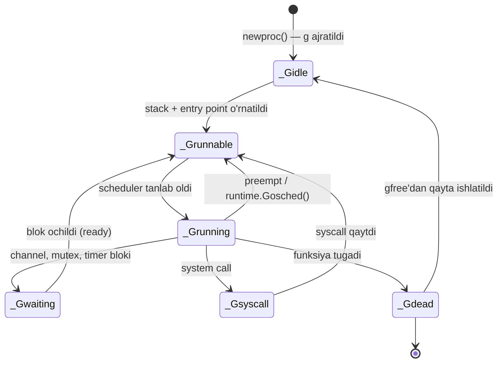

# 🧵 Goroutine — Runtime Level Deep Dive

> **EN** · A goroutine is **not** an OS thread — it is a lightweight thread managed by the Go runtime.
> **UZ** · Goroutine — bu OS thread **emas**, u Go runtime tomonidan boshqariladigan yengil (lightweight) oqim.

---

## 📚 Ushbu bo'lim (Navigation)

| # | Mavzu / Topic | Fayl | Holat |
|:-:|:--------------|:-----|:-----:|
| 1 | Goroutine asoslari · GMP model · ⚪ `_Gidle` | **README.md** *(shu yerda)* | ✅ |
| 2 | 🟡 `_Grunnable` · Run queue · Work stealing | [**Grunnable.md**](./Grunnable.md) | ✅ |
| 3 | 🟢 `_Grunning` · Preemption · sysmon | [**Grunning.md**](./Grunning.md) | ✅ |
| 4 | 🟠 `_Gsyscall` · P handoff · netpoller | [**Gsyscall.md**](./Gsyscall.md) | ✅ |
| 5 | 🔵 `_Gwaiting` · gopark · deadlock · leak | [**Gwaiting.md**](./Gwaiting.md) | ✅ |
| 6 | ⚫ `_Gdead` · gfree · qayta ishlatish | [**Gdead.md**](./Gdead.md) | ✅ |
| 7 | `sync.WaitGroup` — race variant | [`waitgroup_race/`](./waitgroup_race/waitgroup_race.go) | 🚧 |
| 8 | `sync.WaitGroup` — to'g'ri sinxronizatsiya | [`waitgroup_sync/`](./waitgroup_sync/waitgroup_sync.go) | 🚧 |
| 9 | Loop variable closure bug | [`closure_bug/`](./closure_bug/closure_bug.go) | 🚧 |

---

## 1️⃣ Goroutine nima? / What is a Goroutine?

| 🇬🇧 English | 🇺🇿 O'zbekcha |
|:-----------|:-------------|
| A goroutine is the Go runtime's **logical unit of execution** — everything you launch with `go func() {}`. | Goroutine — bu Go runtime'ning **mantiqiy bajarilish birligi**, ya'ni `go func() {}` bilan ishga tushiradigan har bir narsa. |
| It is **multiplexed** onto a small pool of OS threads; thousands of goroutines can share a handful of threads. | U kichik OS thread'lar to'plamiga **multipleks** qilinadi; minglab goroutine bir nechta thread'ni bo'lishib ishlatadi. |
| Its stack starts at **~2 KB** and grows/shrinks dynamically at runtime. | Uning steki **~2 KB** dan boshlanadi va runtime davomida dinamik o'sadi/kichrayadi. |
| Scheduling is **cooperative + preemptive** and happens fully in *user space* — no kernel call needed. | Rejalashtirish **kooperativ + preemptiv** bo'lib, to'liq *user space*'da bajariladi — kernel chaqiruvi kerak emas. |
| Internally each goroutine is a `g` struct with a `status` field tracking its current state. | Ichkarida har bir goroutine `g` struct'i bo'lib, undagi `status` maydoni joriy holatni kuzatib boradi. |

### Goroutine vs OS Thread

| Mezon / Criterion | 🧵 Goroutine | 🧱 OS Thread |
|:------------------|:-------------|:-------------|
| Stack (boshlang'ich) | ~2 KB, dinamik o'sadi | ~1–8 MB, fiksatsiyalangan |
| Yaratish narxi | ~ns (nanosekund) | ~µs (mikrosekund) |
| Kim boshqaradi | Go runtime scheduler | Operatsion tizim kerneli |
| Context switch | User space — arzon | Kernel space — qimmat |
| Amaliy soni | Yuz minglab / millionlab | Bir necha minglab |
| Identifikator | Tashqariga **ochilmagan** (`goroutine ID` yo'q) | Bor (`tid`) |

---

## 2️⃣ GMP Model — Goroutine · Machine · Processor

> ⚠️ **Diqqat / Note:** **M = Machine = OS thread**, **P = Processor = mantiqiy scheduling konteksti**.
> Bu ikkisini bir-biri bilan almashtirib yuborish — eng ko'p uchraydigan xato.

| Harf | To'liq nomi | 🇬🇧 What it is | 🇺🇿 Nima ekanligi |
|:----:|:------------|:---------------|:------------------|
| **G** | **G**oroutine | The logical execution unit — your `go func(){}` code plus its stack and program counter. | Mantiqiy bajarilish birligi — sizning `go func(){}` kodingiz, steki va program counter'i. |
| **M** | **M**achine | The **actual OS thread** that executes machine instructions. Created/parked by the runtime as needed. | Mashina kodini haqiqatda bajaradigan **OS thread**. Runtime ehtiyojga qarab yaratadi/to'xtatadi. |
| **P** | **P**rocessor | The **scheduling context / permit**: holds the local run queue and the resources an M needs to run Go code. Count = `GOMAXPROCS`. | **Scheduling konteksti / ruxsatnoma**: lokal run queue va M'ga Go kodini bajarish uchun kerak bo'lgan resurslarni saqlaydi. Soni = `GOMAXPROCS`. |

### 🗺 Model chizmasi

```text
  ┌──────────────────────────── GO RUNTIME SCHEDULER ────────────────────────────┐
  │                                                                              │
  │    ┌─────────────────┐        ┌─────────────────┐        ┌────────────────┐  │
  │    │       M0        │        │       M1        │        │       M2       │  │
  │    │   (OS thread)   │        │   (OS thread)   │        │  (OS thread)   │  │
  │    └────────┬────────┘        └────────┬────────┘        └───────┬────────┘  │
  │             │ holds                    │ holds                   │ no P      │
  │             ▼                          ▼                         ▼  (idle /  │
  │    ┌─────────────────┐        ┌─────────────────┐        ┌────────────────┐  │
  │    │       P0        │        │       P1        │        │   (parked)     │  │
  │    │  ┌───────────┐  │        │  ┌───────────┐  │        └────────────────┘  │
  │    │  │ LRQ ≤256  │  │        │  │ LRQ ≤256  │  │                            │
  │    │  │ G G G G   │  │◀──────▶│  │ G G       │  │   ⟵ work stealing ⟶       │
  │    │  └───────────┘  │  steal │  └───────────┘  │                            │
  │    └────────┬────────┘        └────────┬────────┘                            │
  │             │ running                  │ running                             │
  │             ▼                          ▼                                     │
  │          ┌─────┐                    ┌─────┐                                  │
  │          │ G7  │                    │ G3  │        _Grunning                 │
  │          └─────┘                    └─────┘                                  │
  │                                                                              │
  │    ┌──────────────────────────────────────────────────────────────────────┐  │
  │    │  GRQ — Global Run Queue (barcha P'lar uchun umumiy, overflow)         │  │
  │    │  G11  G12  G13  G14  …                                               │  │
  │    └──────────────────────────────────────────────────────────────────────┘  │
  └──────────────────────────────────────────────────────────────────────────────┘

  Qoida / Rule:  M must hold a P to execute Go code      →  M ⊕ P ⊕ G = ish bajariladi
                 M Go kodini bajarish uchun P ushlashi shart
```

---

## 3️⃣ Goroutine holatlari — to'liq ro'yxat / All states

| Holat / State | 🇬🇧 Meaning | 🇺🇿 Ma'nosi | Qayerda turadi | Batafsil |
|:--------------|:-----------|:-----------|:---------------|:--------:|
| ⚪ `_Gidle` | Just allocated, not yet initialized. | Endigina ajratildi, hali sozlanmagan. | Hech qayerda (o'tkinchi) | [§4 ↓](#gidle) |
| 🟡 `_Grunnable` | Ready to run, waiting in a queue. | Ishga tayyor, navbatda kutmoqda. | LRQ / GRQ / runnext | [**Grunnable.md**](./Grunnable.md) |
| 🟢 `_Grunning` | Currently executing on an M. | Ayni damda M ustida bajarilmoqda. | M + P ustida | [**Grunning.md**](./Grunning.md) |
| 🟠 `_Gsyscall` | Blocked inside a system call. | System call ichida bloklangan. | M'ga bog'langan, P bo'sh | [**Gsyscall.md**](./Gsyscall.md) |
| 🔵 `_Gwaiting` | Blocked on channel / mutex / timer. | Channel / mutex / timer'da bloklangan. | Obyektning kutish navbatida | [**Gwaiting.md**](./Gwaiting.md) |
| ⚫ `_Gdead` | Finished or not yet used; sits in `gfree`. | Tugadi yoki hali ishlatilmagan; `gfree`da yotadi. | `gfree` ro'yxatida | [**Gdead.md**](./Gdead.md) |
| 🟣 `_Gcopystack` | Stack is being grown/moved. | Stek o'stirilmoqda / ko'chirilmoqda. | O'tkinchi, GC/stek o'sishida | 🚧 |
| 🔴 `_Gpreempted` | Async-preempted, awaiting re-queue. | Asinxron to'xtatildi, navbatga qaytishni kutmoqda. | O'tkinchi, signal'dan keyin | 🚧 |

> 💡 Birinchi **6 tasi** — asosiy hayot sikli va intervyuda so'raladigan qismi.
> Oxirgi ikkitasi — GC va async preemption bilan bog'liq maxsus, o'tkinchi holatlar.

### 🔄 Umumiy holat diagrammasi



---

<a id="gidle"></a>

## 4️⃣ `_Gidle` — eng birinchi holat

| 🇬🇧 English | 🇺🇿 O'zbekcha |
|:-----------|:-------------|
| In Go's runtime every goroutine is represented internally by a struct called `g`. | Go runtime'ida har bir goroutine ichkarida `g` degan struct orqali ifodalanadi. |
| That struct has a `status` field which tracks what state the goroutine is currently in. | Ushbu struct'da `status` maydoni bor — u goroutine hozir qaysi holatda ekanligini kuzatib boradi. |
| `_Gidle` is the **very first** state: right after the `g` struct is allocated, but before the runtime sets it up to run any code. | `_Gidle` — bu **eng birinchi** holat: `g` struct'i ajratilgandan keyin, lekin runtime uni kod bajarishga tayyorlashdan oldin. |
| It has **no stack**, **no program counter**, **nothing runnable** yet. | Unda hali **stek yo'q**, **program counter yo'q**, **ishga tayyor hech narsa yo'q**. |

### 🧠 Analogiya / Analogy

> **EN** · Like creating a new employee record in a company database — the record exists (it has an ID, a slot), but the person hasn't been trained, given a desk, or assigned a task yet. **That's `_Gidle`.**
>
> **UZ** · Kompaniya bazasida yangi xodim yozuvini yaratganday — yozuv mavjud (ID'si, joyi bor), lekin odam hali o'qitilmagan, stol berilmagan, vazifa tayinlanmagan. **Mana shu `_Gidle`.**

### 🗺 Lifecycle chizmasi

```text
    ┌──────────────────────┐
    │   go func() { … }    │   ← siz yozgan kod / your code
    └──────────┬───────────┘
               │  runtime.newproc()
               ▼
    ┌──────────────────────┐
    │    G  allocated      │   gfree'dan qayta ishlatiladi yoki yangi ajratiladi
    │    G  ajratildi      │   reused from gfree list, or freshly allocated
    └──────────┬───────────┘
               ▼
    ┌──────────────────────┐
    │      _Gidle          │   ⚡ stack ❌ · PC ❌ · args ❌
    │   bo'sh holat        │      nanosekundlar davomida
    └──────────┬───────────┘
               │  stack + entry fn + args to'ldirildi
               ▼
    ┌──────────────────────┐
    │    initialized       │   ✅ stack · ✅ PC · ✅ args
    │   to'liq tayyor      │
    └──────────┬───────────┘
               ▼
    ┌──────────────────────┐
    │     _Grunnable       │   →  runq'ga qo'yildi, P/M kutmoqda
    └──────────────────────┘      see: Grunnable.md
```

### 📋 Bosqichlar / Steps

| Bosqich | 🇬🇧 What happens | 🇺🇿 Nima sodir bo'ladi |
|:--------|:----------------|:----------------------|
| **G allocated** | The scheduler's `newproc()` grabs a `g` struct — brand new, or reused from the `gfree` list for efficiency. | `go func(){}` yozganda scheduler ichidagi `newproc()` ishga tushadi va `g` struct oladi — yangi, yoki samaradorlik uchun `gfree` ro'yxatidan qayta ishlatadi. |
| **`_Gidle`** | At this exact allocation moment the status is `_Gidle`. No stack, no PC, nothing runnable. | Aynan shu ajratish paytida holat `_Gidle` bo'ladi. Stek yo'q, program counter yo'q, hech narsa tayyor emas. |
| **initialized** | The runtime fills in the stack, entry function and arguments, then transitions to `_Grunnable`. | Runtime stek, bajariladigan funksiya va argumentlarni to'ldiradi, so'ng `_Grunnable`ga o'tkazadi. |

### ❓ Nega buni odatda kuzata olmaymiz? / Why you won't observe it

| 🇬🇧 English | 🇺🇿 O'zbekcha |
|:-----------|:-------------|
| The transition happens inside the **same `newproc()` call**, with no scheduling point in between. | O'tish **bitta `newproc()` chaqiruvi ichida**, orada hech qanday scheduling nuqtasi bo'lmagan holda sodir bo'ladi. |
| So from a Go programmer's perspective you never get a chance to "catch" a goroutine sitting in `_Gidle`. | Shuning uchun Go dasturchisi sifatida siz goroutine'ni `_Gidle` holatida hech qachon "ushlab qololmaysiz". |
| It is purely internal bookkeeping — a transient placeholder, not exposed via `runtime.NumGoroutine()` or `pprof`. | Bu sof ichki hisob-kitob — o'tkinchi (transient) belgi; `runtime.NumGoroutine()` yoki `pprof`da ko'rinmaydi. |
| Even runtime tracing tools rarely surface it, since a `g` spends only nanoseconds there. | Hatto runtime trace vositalari ham buni kamdan-kam ko'rsatadi, chunki `g` u yerda faqat nanosekundlar turadi. |

---

## 5️⃣ Bu papkadagi kod / Code in this folder

| Fayl | Nima ko'rsatadi | Ishga tushirish |
|:-----|:----------------|:----------------|
| [`main.go`](./main.go) | Barcha demolarni chaqiruvchi kirish nuqtasi | `go run ./02-concurrency/goroutine` |
| [`waitgroup_race/`](./waitgroup_race/) | `WaitGroup` noto'g'ri ishlatilganda yuzaga keladigan race | `go test -race ./02-concurrency/goroutine/waitgroup_race` |
| [`waitgroup_sync/`](./waitgroup_sync/) | `WaitGroup` bilan to'g'ri sinxronizatsiya | `go test ./02-concurrency/goroutine/waitgroup_sync` |
| [`closure_bug/`](./closure_bug/) | Loop o'zgaruvchisini closure ichida ushlash xatosi | `go test ./02-concurrency/goroutine/closure_bug` |

---

## 6️⃣ Intervyu savollari / Interview questions

| # | Savol / Question | Kalit javob / Key answer |
|:-:|:-----------------|:-------------------------|
| 1 | Goroutine OS thread'dan nimasi bilan farq qiladi? | ~2 KB o'suvchan stek, user-space scheduler, arzon context switch, M'larga multipleks qilinadi. |
| 2 | GMP'dagi **P** nima uchun kerak? | Bu scheduling konteksti va lokal run queue egasi; `GOMAXPROCS` parallellikni cheklaydi. M Go kodini bajarish uchun P ushlashi shart. |
| 3 | `_Gidle` holatini `pprof`da ko'ra olamizmi? | Yo'q — u `newproc()` ichida nanosekundlarda o'tib ketadigan ichki, o'tkinchi holat. |
| 4 | Goroutine tugagach `g` struct'i o'chiriladimi? | Yo'q — `_Gdead` bo'lib `gfree` ro'yxatiga tushadi va keyingi `go func(){}` uchun qayta ishlatiladi. |
| 5 | `GOMAXPROCS` M'lar sonini cheklaydimi? | Yo'q — u **P**'lar sonini cheklaydi. M'lar soni bloklovchi syscall'lar tufayli undan ancha ko'p bo'lishi mumkin. |

---

<div align="center">

⬅️ [Ortga: 02-concurrency](../) · ➡️ [Keyingi: `_Grunnable`](./Grunnable.md)

</div>
